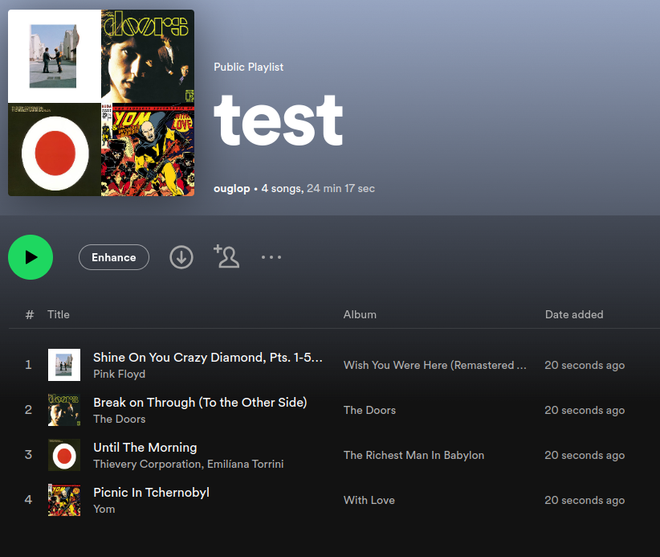

# Lalipo


Lalipo is made to generate spotify playlists from raw text, for example from this input,

```
Ping floyd shine on you
The doors break on through
Thievery corporation until the morning
Yom picnic in tchernobyl
```

A new playlist will be created in your account:




# Development

In order to run your own version of Lalipo, you will need to first create a Spotify app: head over to https://developer.spotify.com/dashboard , then create a new app. You will need the client id / client secret for the deployment.

## Deploy

Lalipo is a standard django app. To deploy locally:

1. Install the dependencies in a virtual env, then activate it.
2. Copy `.env.skeleton` to `.env`, then fill in the values.
2. Run `./manage.py migrate` to apply the migrations.
3. Run `./manage.py runserver` to run the development server.
